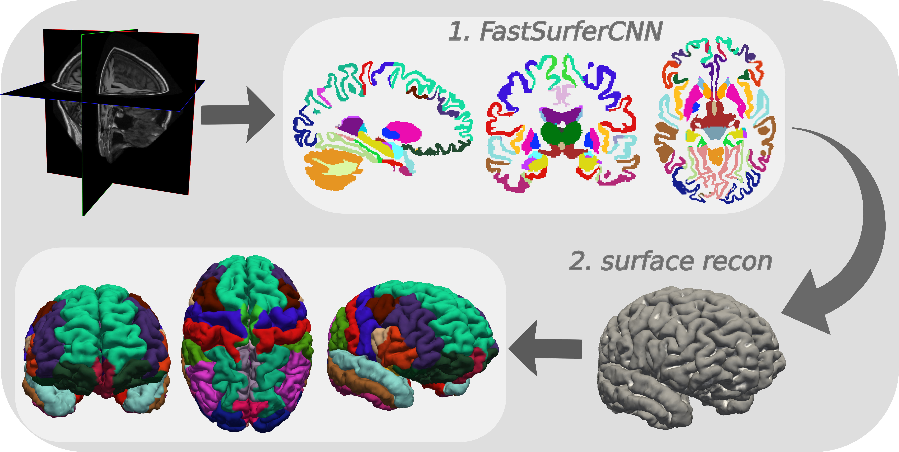

.. FastSurfer documentation master file; modified and updated by
   David Kügler of the FastSurfer Team.

.. include:: ../README.md
   :parser: fix_links.parser
   :relative-docs: .
   :start-after: <!-- start of content -->
   :end-before: <!-- start of image requirements -->

.. rubric:: Get started

.. grid:: 1 2 2 4
   :gutter: 3

   .. grid-item-card:: Quick Start
      :link: overview/QUICKSTART
      :link-type: doc

      Segment an example image in a few minutes.

   .. grid-item-card:: Installation
      :link: overview/INSTALL
      :link-type: doc

      Install FastSurfer on macOS, Linux or Windows.

   .. grid-item-card:: Examples
      :link: overview/EXAMPLES
      :link-type: doc

      Run the full pipeline, many subjects, or on a cluster.

   .. grid-item-card:: Output files
      :link: overview/OUTPUT_FILES
      :link-type: doc

      Find the segmentations, surfaces and statistics.

.. include:: ../README.md
   :parser: fix_links.parser
   :relative-docs: .
   :start-after: <!-- start of references -->

.. toctree::
   :hidden:

   overview/index
   scripts/index
   developer/index
   api/index