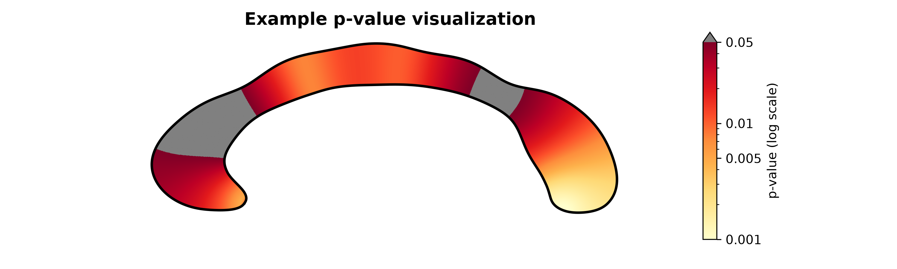

CorpusCallosum: cc_visualization.py
===================================

.. argparse::
   :module: CorpusCallosum.cc_visualization
   :func: make_parser
   :prog: cc_visualization.py

Usage Examples
--------------

3D Visualization
~~~~~~~~~~~~~~~~

To visualize a 3D template generated by ``fastsurfer_cc.py`` (using ``--slice_selection all --save_template_dir ...``),
point the script to the exported template directory:

.. code-block:: bash

    python3 -m CorpusCallosum.cc_visualization \
        --template_dir /data/templates/sub001/cc_template \
        --output_dir /data/visualizations/sub001

2D Visualization
~~~~~~~~~~~~~~~~

To visualize a 2D template (using ``--slice_selection middle --save_template_dir ...``):

.. code-block:: bash

    python3 -m CorpusCallosum.cc_visualization \
        --template_dir /data/templates/sub001/cc_template \
        --output_dir /data/visualizations/sub001 \
        --twoD

The template's ``thickness_values_<slice>.txt`` is a per-contour-vertex file,
not a one-value-per-level-path profile. Each thickness measurement occurs at
both ends of its level path, so the non-empty measurements follow the contour
as anterior-to-posterior and then posterior-to-anterior. Do not copy a JSON
``thickness_profile`` directly into this template file.

To visualize a one-column CSV of p-values on the bundled fsaverage contour,
where the first row is a header and the remaining rows contain positive values
ordered from anterior to posterior:

.. code-block:: bash

    python3 -m CorpusCallosum.cc_visualization \
        --values_file /data/p_values.csv \
        --output_dir /data/visualizations \
        --mode p-value \
        --colormap yellow_to_red \
        --log_scale \
        --upper_threshold 0.05 \
        --threshold_color gray \
        --twoD

The ``--values_file`` format is also the supported way to visualize a
``thickness_profile`` copied from the FastSurfer JSON output: write its values
once, in their existing anterior-to-posterior order, beneath a single header
such as ``thickness`` and select ``--mode thickness``.

For the default midslice metrics file, ``jq`` can create this input without
changing the order:

.. code-block:: bash

    jq -r '"thickness", .thickness_profile[]' \
        stats/callosum.CC.midslice.json > thickness_profile.csv

The same command can be run from a FastSurfer container without installing
FastSurfer or FreeSurfer on the host. From the directory containing
``p_values.csv``:

.. code-block:: bash

    mkdir -p visualizations

    docker run --rm \
        --user "$(id -u):$(id -g)" \
        --volume "$PWD/p_values.csv:/input/p_values.csv:ro" \
        --volume "$PWD/visualizations:/output" \
        --entrypoint /fastsurfer/tools/Docker/entrypoint.sh \
        deepmi/fastsurfer:latest \
        python3 /fastsurfer/CorpusCallosum/cc_visualization.py \
        --values_file /input/p_values.csv \
        --output_dir /output \
        --mode p-value \
        --colormap yellow_to_red \
        --log_scale \
        --upper_threshold 0.05 \
        --threshold_color gray \
        --legend "p-value (log scale)" \
        --title "Example p-value visualization" \
        --output_name p_values_fsaverage_2d.png \
        --smoothing_window 0 \
        --twoD

The output is written to ``visualizations/p_values_fsaverage_2d.png``. On macOS, the
``--user`` option can be omitted if Docker Desktop reports a user-mapping
problem.

The following example uses 100 smoothly varying dummy p-values. Values above
0.05 are shown in gray; the remaining values use a logarithmic yellow-to-red
scale.

   A 2D p-value visualization generated by the container command above.

.. note::

   Use ``--template_dir`` to load templates produced by ``fastsurfer_cc.py``.

   ``--values_file`` instead uses a precomputed fsaverage corpus-callosum
   contour bundled with FastSurfer. It does not require ``FREESURFER_HOME`` or
   a separate FreeSurfer installation.

Outputs
-------

3D Mode Outputs (default):
    - ``cc_mesh.vtk``: VTK format mesh file for 3D visualization
    - ``cc_mesh.fssurf``: FreeSurfer surface format
    - ``cc_mesh_overlay.curv``: FreeSurfer overlay file with thickness values
    - ``cc_mesh.html``: Interactive 3D mesh visualization
    - ``cc_mesh_snap.png``: Snapshot image of the 3D mesh
    - ``midslice_2d.png``: 2D visualization of the middle slice

2D Mode Outputs (when ``--twoD`` is specified):
    - ``cc_thickness_2d.png``: 2D contour visualization with thickness colormap
    - The filename passed to ``--output_name`` for ``--values_file`` input
